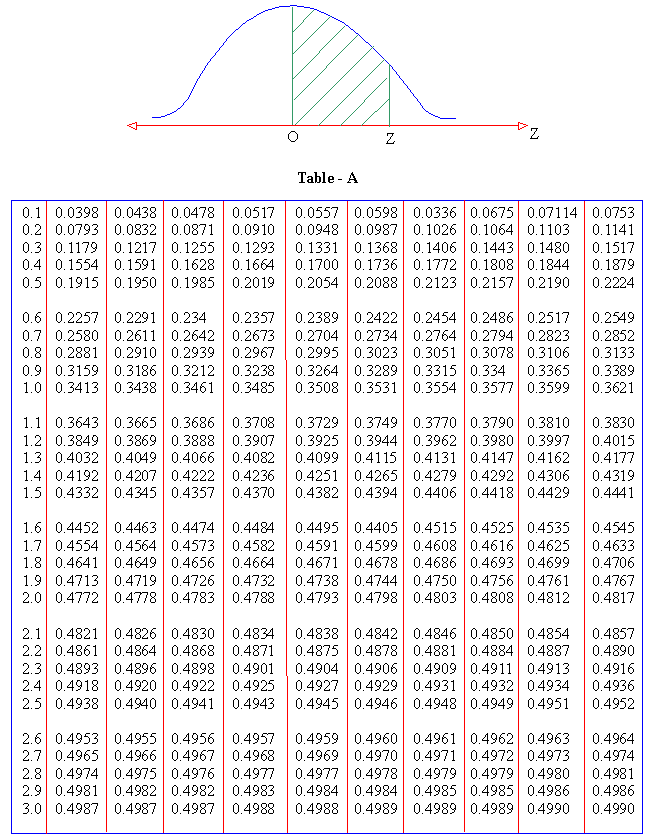
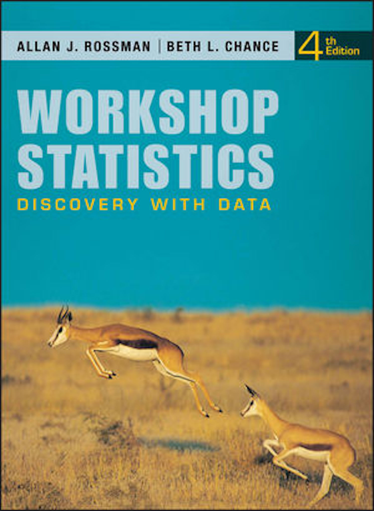

class: center, middle

# My story teaching Intro Stats

```{r setup, include=FALSE}
# devtools::install_github("yihui/xaringan")
options(htmltools.dir.version = FALSE)
knitr::opts_chunk$set(echo = FALSE)
```

```{r}

```

---

class: center, middle

# My story teaching Intro Stats

  |   
:-------------------------:|:-------------------------:

---

class: center, middle

# My story teaching Intro Stats

```{r}

```

---

class: center, middle

# My story teaching Intro Stats

  |   
:-------------------------:|:-------------------------:

---

class: center, middle

# My story teaching Intro Stats

```{r}

```

---

class: center, middle

# My story teaching Intro Stats

  |   
:-------------------------:|:-------------------------:

---

class: center, middle

# My story teaching Intro Stats

  |   
:-------------------------:|:-------------------------:

---

class: center, middle

# My story teaching Intro Stats

  |   
:-------------------------:|:-------------------------:

---

class: center, middle

# My story teaching Intro Stats

  |   
:-------------------------:|:-------------------------:

---

class: center, middle

# ModernDive

## An Introduction to Statistical and Data Sciences via R

### [ModernDive.com](http://moderndive.com)

OR

### [ModernDive.org]((http://moderndive.com)

---

# Guiding Principles of ModernDive

## 1. Blur the lines between lecture and lab

```{r out.width="75%"}

```


---

## 2. Focus on the entire data/science research pipeline

```{r out.width="100%"}
knitr::include_graphics("images/hadley.png")
```

---

## 3. It's all about the data

### - Use the `tidyverse` with rich, interesting, open data sets

```{r out.width="100%", fig.align='center'}
knitr::include_graphics("images/hadleyphoto.jpg")
```

---

## 4. Use simulation/resampling not probability/large sample approximation

### - Reinforce concepts, not equations, formulas, and probability tables.

```{r out.width="100%"}
knitr::include_graphics("images/ht.png")
```

---

## 5. Don’t fence off students from the computation pool, throw them in!

### - Scaffold & support as a good foreign language professor would

```{r out.width="80%", fig.align='center'}

```

---

## 6. Complete reproducibility

### - Put it all out there

### - Ultimately the best textbook is one you’ve written yourself

```{r out.width="80%"}
knitr::include_graphics("images/precious.gif")
```

---


class: center, middle

# Student feedback

---

class: center, middle

# Demo

---

# What's to come

### - Implement more book formats (epub, Word document, etc.)

### - Allow for easier customization of textbook

### - Add more interactive shiny apps into the book

### - Create Review Questions at chapter ends using open data sources

### - Design and share instructor resources

---


# Thanks!

- Slides created via the R package [**xaringan**](https://github.com/yihui/xaringan).

- [ModernDive.com](http://moderndive.com)

- Fork our GitHub repository at <br> <https://github.com/ismayc/moderndiver-book>

    - Please feel free to modify the book as you wish for your own needs! All we ask is that you
list the authors field above as "Chester Ismay, Albert Y. Kim, and YOU!"

- Fill out our Google Form to receive updates at <br> <http://bit.ly/moderndive-users>

- Email us at chester@moderndive.com or albert@moderndive.com

- Getting Used to R, RStudio, and R Markdown book at <https://ismayc.github.io/rbasics-book/>
